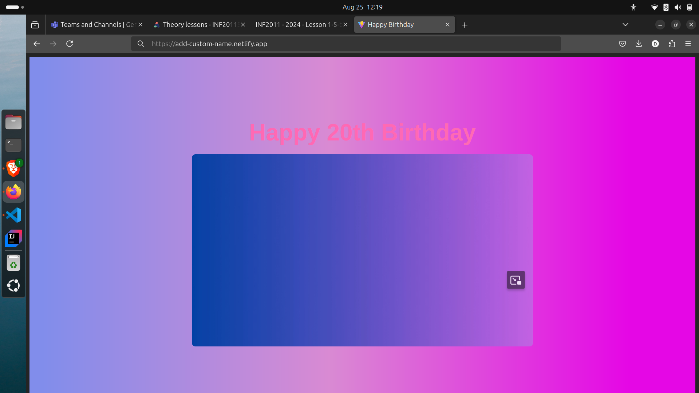

# Birthday Surprise Site

This project is a special birthday surprise website, designed to create a memorable and romantic way to ask someone to be your girlfriend. The site plays a custom video and displays a heartfelt message, with an interactive button for the user to accept and trigger an email notification.

## Features
- **Video Section**: A custom video plays automatically, showcasing a special montage of memories.
- **Message Section**: A sweet and romantic message appears on the page, with a single button asking the user to accept and confirm the relationship request.
- **Email Notification**: When the button is clicked, an email is automatically sent to notify that the proposal has been accepted.

## How to Reuse This Project
Anyone can use this site for their own romantic birthday surprise! Simply clone the repository and modify the content to suit your needs.

### Steps to Customize:
1. **Video**: Replace the `my-g-bd-vd.mp4` file in the `assets` folder with your own custom video file.
2. **Message**: Modify the `MessageSection.jsx` file to customize the message shown on the page.
3. **Email Setup**: 
   - Sign up for an [EmailJS](https://www.emailjs.com/) account.
   - Create a service and email template in EmailJS.
   - Replace the `serviceID`, `templateID`, and `publicKey` in the `MessageSection.jsx` file with your own from EmailJS. Follow these steps:
      - Go to **EmailJS** and create a new service (linked to your email account).
      - In the **Email Templates** section, set up a template that will be sent when the button is clicked.
      - Use the API keys (public key, service ID, and template ID) provided by EmailJS in your code to integrate the email functionality.
4. **Video Designing**:
   - **Using CapCut**: CapCut is a simple video editing tool where you can add text, transition effects, music, and edit your video clips together. Download [CapCut](https://www.capcut.com/) and follow the instructions to design your video.
   - **Using Canva**: If you prefer web-based editing, [Canva](https://www.canva.com/) offers a free video editor with a drag-and-drop interface. It’s ideal for creating videos from images, adding music, text, and effects. You can export your video in MP4 format and use it on the site.
   - Once your video is ready, export it as an **MP4** and place it in the `assets` folder, then update the video source in the code.

### Installation and Running
To run this project locally, follow these steps:

1. Clone this repository:

```bash
git clone https://github.com/NtandoMgo/birthday-surprise-site.git
```

2. Navigate to the project directory:

```bash
cd birthday-surprise-site
```

3. Install the dependencies:

```bash
npm install
```

4. Start the development server:

```bash
npm run dev
```

Your site will be available at `http://localhost:5173`.

### Deployment
You can deploy this project to any static hosting provider like Netlify, Vercel, or GitHub Pages.
**Desktop Version:** 

**Mobile Version:** 

## Technologies Used
- **React.js**: For building the user interface.
- **Vite**: A fast development server and build tool.
- **CSS**: Custom styling for the page.
- **EmailJS**: For sending emails when the button is clicked.
- **CapCut** or **Canva**: For designing the custom video used on the site.

## Screenshots
Here's how its looks like on desktop and mobile


## License
This project is open-source and available under the [MIT License](LICENSE).
